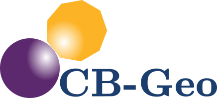

# C++ Programming Guidelines
> Cambridge-Berkeley Computational Geomechanics Group

> Krishna Kumar [info@cb-geo.com](mailto:info@cb-geo.com)
 

C++ is the main development language for most of our projects. The goal of this guide is to manage this complexity by describing in detail the dos and don'ts of writing C++ code. These guidelines exist to keep the code base manageable and consistent.

